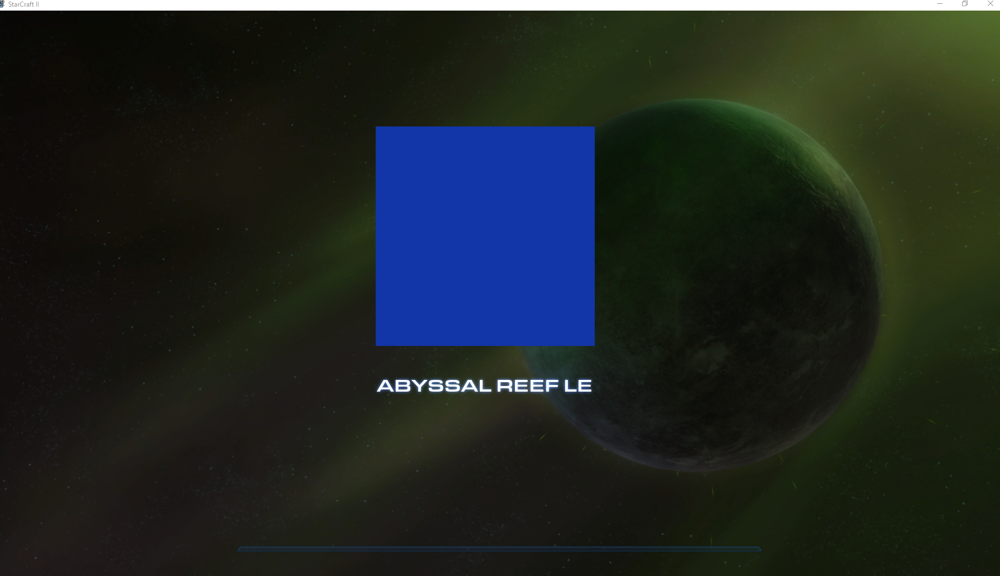
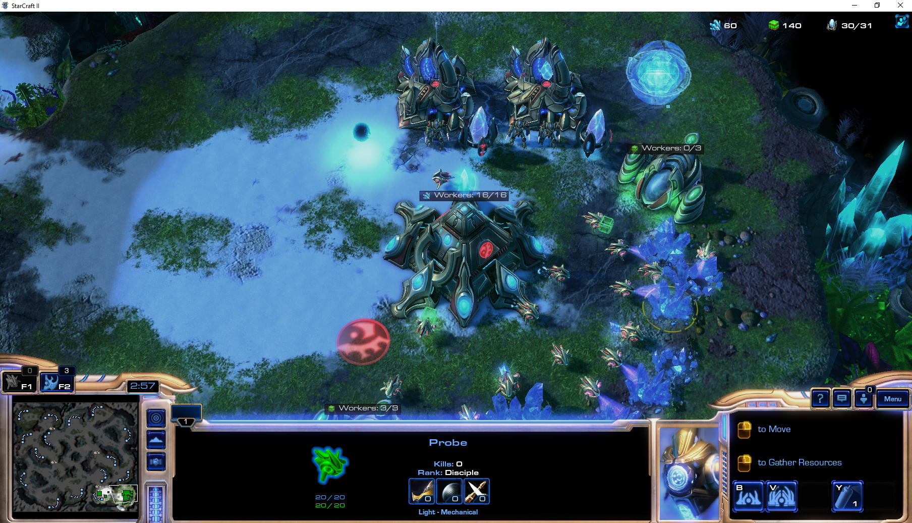
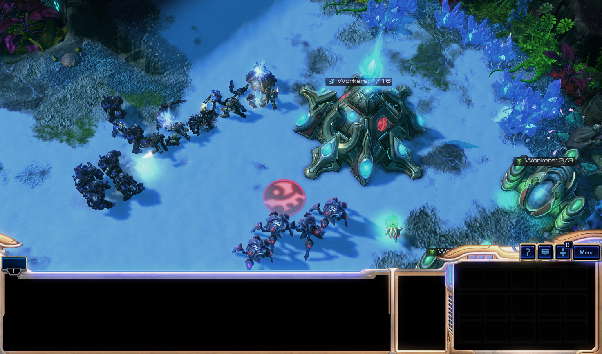
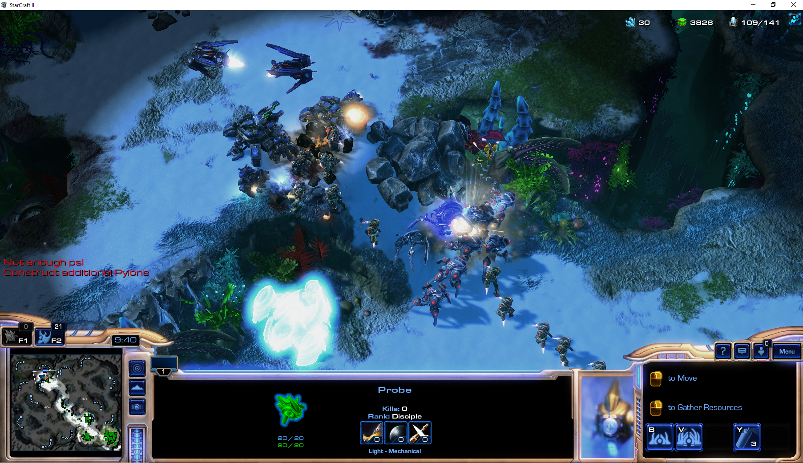

# Python Starcraft 2 Bot

    A python based Starcraft 2 bot that plays with a terran computer enemy.

## Prerequisites:

*  python-sc2 package
*  Starcraft 2
*  python sc2 Map Pack

## Built with:

* python-sc2 package
* random module

## What it can accomplish during a game:

### Launch game:

    Lanches the map and enemy player.
    

### Build up base and army:

    Builds workers, base units, and attacking units.

### Defends base from attack:

    Attacks any enemy spotted or attacking.

### Attacks enemy base:

    When enough attacking units are produced, the bot attacks and defeats the enemy player.

